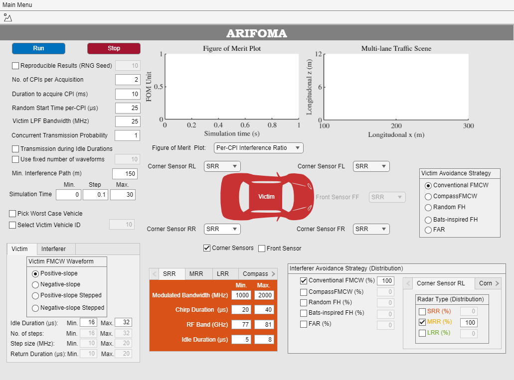
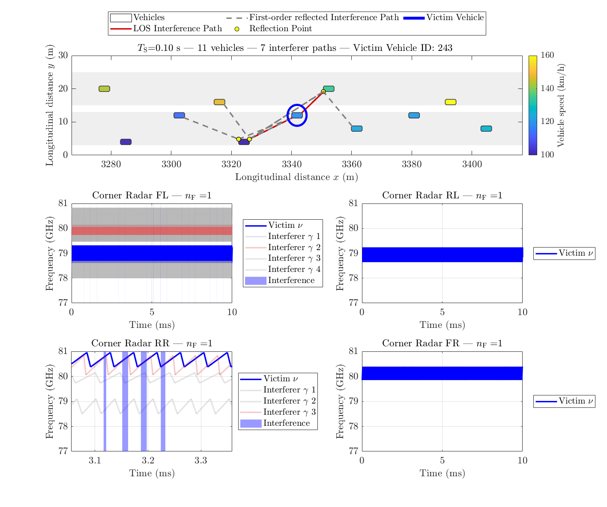

# ARIFOMA — Automotive Radar Interference Figures of Merit Analysis

> A MATLAB simulation framework for analyzing automotive FMCW radar interference and mitigation strategies in realistic multi-lane traffic scenarios, built on top of SUMO and WiLabVISim.

**Authors:** Arianit Preniqi, Oliver Lang, Stefan Schmalzl, Reinhard Feger

**Affiliations:**
- Christian Doppler Laboratory for Distributed Microwave- and Terahertz-Systems for Sensors and Data Links, Johannes Kepler University Linz, Austria
- Institute of Signal Processing, Johannes Kepler University Linz, Austria
- Infineon Technologies AG, Neubiberg, Germany

**Contact:** arianit.preniqi@jku.at

---

## Table of Contents

1. [Overview](#overview)
2. [Framework Architecture](#framework-architecture)
3. [Repository Structure](#repository-structure)
4. [Requirements](#requirements)
5. [Installation](#installation)
6. [Quick Start](#quick-start)
7. [Configuration Reference](#configuration-reference)
8. [Graphical User Interface](#graphical-user-interface)
9. [Visaulization](#visualization)
10. [Interference Model](#interference-model)
11. [Figures of Merit](#figures-of-merit)
12. [Radar Deployments](#radar-deployments)
13. [Mitigation Strategies](#mitigation-strategies)
14. [Output Files](#output-files)
15. [Reproducing Published Results](#reproducing-published-results)
16. [Citation](#citation)

---

## Overview

Automotive frequency-modulated continuous-wave (FMCW) radar is a key sensing technology for advanced driver assistance systems (ADAS) and autonomous driving. As the number of radar-equipped vehicles increases, mutual radar interference becomes a relevant challenge, particularly in dense traffic scenarios. Interference typically appears as high-amplitude chirp-like artifacts in the intermediate frequency (IF) signal, degrading target detection performance by increasing the likelihood of missed or false detections.

**ARIFOMA** (Automotive Radar Interference Figures of Merit Analysis) is a simulation framework for analyzing radar interference and mitigation strategies in realistic multi-lane traffic scenarios. While SUMO and WiLabVISim provide the underlying traffic-level and propagation-path-level modeling respectively, ARIFOMA implements a radar-level signal model that enables:

- Heterogeneous radar parametrization across SRR, MRR, and LRR configurations
- Waveform-level interference modeling per coherent processing interval (CPI)
- Integration and comparative evaluation of several interference mitigation strategies
- Quantification of unified interference-related figures of merit (FOMs)

Unlike existing tools that generally focus on individual FOMs such as interference-induced noise floor (IINF) or signal-to-interference ratio (SIR), ARIFOMA enables their joint evaluation through a common set of measures, providing a consistent basis for comparing interference effects and mitigation strategies across traffic scenarios and radar deployments.

---

## Framework Architecture

ARIFOMA is the radar-level layer of a three-tier simulation stack:

**Traffic-level modeling (SUMO):** The highway traffic scenario is generated with *L* lanes in eastbound and westbound direction and a vehicle density of *V* vehicles/km. 

**Propagation-level modeling (WiLabVISim):** Vehicles may carry either four corner radars with 60° field-of-view (FOV) or one front radar with 30° FOV. SUMO provides vehicle positions and velocities at acquisition intervals of at least *T*_A = 100 ms. WiLabVISim identifies radar pairs that are geometrically visible within their corresponding FOVs, considering both line-of-sight (LOS) paths and first-order reflected paths. This yields the set of potential interferers for the subsequent radar-level analysis. 
> **Note:** See https://github.com/V2Xgithub/WiLabVIsim

**Radar-level modeling (ARIFOMA):** Radar waveform parameters are assigned to all radars according to the selected deployment. For each acquisition interval, a full transmission waveform with fixed CPI duration *T*_F is generated for the victim radars and all potential interferers. Interference occurs when a potential interferer overlaps within the victim's low-pass filter (LPF) bandwidth. Interference metrics are computed per CPI to obtain the unified FOMs.

---

## Repository Structure

```
ARIFOMA/
│
├── main_sim.m                               % Main simulation entry point
│
├── core/                                    % Core processing functions
│   ├── ARIFOMA_build_parameter_table.m      % Assign waveform params to all radars
│   ├── ARIFOMA_prepare_scene_views.m        % Build per-corner link tables
│   ├── ARIFOMA_apply_all_schemes.m          % Apply mitigation scheme logic
│   ├── ARIFOMA_build_engine_inputs.m        % Assemble CPI engine input bundle
│   ├── ARIFOMA_run_strategy.m               % Dispatch to selected strategy
│   ├── ARIFOMA_postprocess_and_update_ctx.m % Compute FOMs and update context
│   ├── ARIFOMA_init_radarcorner_contexts.m  % Initialise per-corner context structs
│   ├── ARIFOMA_apply_victim_overrides.m     % Override victim waveform/scheme
│   └── ARIFOMA_find_worst_interference_vehicle.m
│
├── scene/                                   % Scene extraction and rendering
│   ├── ARIFOMA_frame_extract_mc.m
│   ├── ARIFOMA_frame_draw_mc.m
│   └── prepopulate_lastF0BySensor.m
│
├── utils/                                   % Utility and helper functions
│   ├── scenario_defaults.m
│   └── prep_axes.m
│
├── data/                                    % Placeholder for scenario MAT-files
│   └── README_data.md
│
├── results/                                 % Output MAT-files (git-ignored)
│
└── README.md
```

---

## Requirements

| Requirement | Version | Notes |
|---|---|---|
| MATLAB | R2021a or later | Tested on R2022b and R2023a |
| Signal Processing Toolbox | any | Required for IF signal and spectrum processing |
| Phased Array System Toolbox | any | Required for range-Doppler processing |
| SUMO | 1.14+ | Only needed to regenerate scenario data |
| WiLabVISim | — | Only needed to regenerate scenario data |

> Pre-computed scenario MAT-files are provided separately (see [Reproducing Published Results](#reproducing-published-results)). SUMO and WiLabVISim are not required to run the simulation with the provided data.

---

## Installation

1. **Clone the repository**

```bash
git clone https://github.com/ArianitJKU/ARIFOMA.git
cd ARIFOMA
```

2. **Add to the MATLAB path**

```matlab
addpath(genpath('path/to/ARIFOMA'));
```

3. **Place scenario data**

Download the scenario MAT-file (see [Reproducing Published Results](#reproducing-published-results)) and update the input path in `main_sim.m`:

```matlab
cfg.inputMat = 'path/to/Density85Highwaydata.mat';
```

---

## Quick Start

1. Open `main_sim.m` in MATLAB.
2. Set `cfg.inputMat` to the path of your scenario MAT-file.
3. Set the victim selection mode (specific vehicle, worst-case, or random).
4. Run the script:

```matlab
run('main_sim.m')
```

Results are saved to `radarCtx<cfg.sceneTag>.mat` in the working directory.

---

## Configuration Reference

All experiment parameters are set in the **User Configuration** section of `main_sim.m`. The tables below summarise the most commonly adjusted fields, using the notation of the accompanying paper where applicable.

### Simulation Time and Scenario

| Field | Symbol | Default | Description |
|---|---|---|---|
| `cfg.TA` | *T*_A | `0.1` | Acquisition time snapshots|
| `cfg.TS` | *T*_S | `30`  | Total simulation duration |
| `cfg.simTime` | — | `0:cfg.TA:cfg.TS` | Acquisition vector |
| `cfg.sceneTag` | — | see script | Tag appended to all output filenames |
| `cfg.CPI_duration_s` | *T*_F | `10e-3` | CPI duration [s] |
| `cfg.numberofCPIsperAcquisition` | *N*_F | `2` | CPIs obtained per acquisition interval |
| `cfg.BADC_Hz` | *B*_LPF,ν | `25e6` | Receiver LPF / ADC bandwidth [Hz] |
| `cfg.randstartTime` | *t*_s,ϱ bound | `40e-6` | Upper bound for random chirp start time *t*_s,ϱ [s] |

### Victim Selection

| Field | Default | Description |
|---|---|---|
| `cfg.worstVehicle` | `false` | Automatically select the highest-interference victim vehicle |
| `cfg.specificVehicle` | `true` | Use the fixed ID in `cfg.VehID` |
| `cfg.VehID` | `243` | Victim vehicle ID (used when `specificVehicle = true`) |

> Only one of `cfg.worstVehicle` and `cfg.specificVehicle` should be `true`. If both are `false`, a random sensor-equipped vehicle is selected.

### Radar Deployment and Parameter Mode

| Field | Default | Description |
|---|---|---|
| `cfg.paramMode` | `"EXTENDED"` | Parameter-generation mode (see [Radar Deployments](#radar-deployments)) |
| `cfg.UseFixedSeed` | `false` | Force deterministic RNG — overrides `paramMode` to `"FIXED PARAMETER POOL"` |
| `cfg.Seed` | `7` | RNG seed, if reproducible results are desired) |
| `cfg.pHasSensor` | `1` | Concurrent transmission probability |
| `cfg.victimscenarioPerCorner` | all `"MRR"` | Radar class assigned to each victim corner (FL, FR, RL, RR) |

### Victim Waveform Override

| Field | Default | Description |
|---|---|---|
| `cfg.adaptWaveformVictim` | `"POSITIVE-SLOPE"` | Chirp waveform type forced onto the victim |
| `cfg.adaptSchemeVictim` | `"CONVENTIONAL"` | Mitigation scheme forced onto the victim |

### COMPASS Carrier-Frequency Band Assignment

Each cardinal direction maps to a 1 GHz sub-band within the 77–81 GHz operating range:

| Field | Default [Hz] | Compass Sector |
|---|---|---|
| `cfg.compassFcBands.NW` | `[77e9, 78e9]` | North-West |
| `cfg.compassFcBands.NE` | `[78e9, 79e9]` | North-East |
| `cfg.compassFcBands.SE` | `[79e9, 80e9]` | South-East |
| `cfg.compassFcBands.SW` | `[80e9, 81e9]` | South-West |

---

## Interference Model

ARIFOMA implements the following radar-level interference model. Let *N*_R FMCW radars operate with index set R = {1, …, *N*_R}. Radar ϱ ∈ R transmits *N*_s,ϱ linear chirps starting at frequency *f*_0,ϱ with chirp slope κ_ϱ = *B*_κ,ϱ / *T*_κ,ϱ, where *B*_κ,ϱ is the modulation bandwidth and *T*_κ,ϱ the active chirp interval. Each chirp is followed by an idle interval *T*_i,ϱ, giving a pulse repetition interval (PRI) of *T*_PRI,ϱ = *T*_κ,ϱ + *T*_i,ϱ.

Victim radar ν ∈ R experiences interference from interferer γ when the instantaneous IF frequency difference satisfies |Δ*f*| ≤ *B*_LPF,ν, where *B*_LPF,ν is the victim's LPF bandwidth (set by `cfg.BADC_Hz`). The resulting interference duration per chirp pair is:

```
T_I,ν,γ = 2 * B_LPF,ν / |κ_ν − κ_γ|
```

Received interference power is modeled according to the dominant propagation path — either a LOS path with distance *d*_D,ν,γ or a first-order reflected path with distance *d*_R,ν,ρ,γ via reflection point ρ, with associated path attenuation β_ρ.

In practice, geometrically visible radars are not always transmitting simultaneously. This is modeled by the concurrent transmission probability *P*_CT, defined as the fraction of radars that obtain CPIs within the same time window. Random transmission start times *t*_s,ϱ and the number of CPIs per acquisition interval *N*_F are both configurable.

---

## Graphical User Interface

ARIFOMA includes a graphical user interface (GUI) built as a MATLAB App,
designed to allow users to configure and execute the full simulation
workflow — including scenario loading, radar deployment setup, victim
selection, and FOM visualization — without directly editing the
simulation scripts.


*Preliminary view of the ARIFOMA GUI. Full release pending acceptance
of the corresponding publication.*

> **Note:** The ARIFOMA GUI application is currently withheld pending
> acceptance of the accompanying publication. It will be released in this
> repository upon acceptance.

---

## Visualization

> **Note:** The live visualization described below applies to the manual 
> simulation script (`main_sim.m`). The ARIFOMA GUI app has its own 
> integrated visualization interface (see [Graphical User Interface](#graphical-user-interface)).

During simulation, `main_sim.m` generates a live tiled display consisting of:

- **Scene overview (top panel):** A top-down view of the highway scene at
  each acquisition snapshot, showing all vehicles, sensor fields of view,
  and the active interference paths between the victim and its potential
  interferers.

- **Per-corner spectrogram panels (2×2 tiles):** One panel per victim
  corner (FL, FR, RL, RR), displaying the IF signal spectrogram for each
  CPI. These panels visualize the interference structure
  directly in the time-frequency domain, including the overlap with the victim's LPF bandwidth.
  
*Preliminary view of the ARIFOMA visualization.*
---

## Figures of Merit

For each CPI obtained by the victim vehicle's radars, ARIFOMA computes the following unified interference-related FOMs:

| Metric | Definition | FOM |
|---|---|---|
| **Per-CPI interference ratio** | Fraction of PRIs interfered at least once within a CPI | Interference probability, consecutive interfered PRIs, signal reconstruction constraints |
| **Normalized interference duration** | Fraction of interfered samples in the IF signal: *T*_I,ν,γ / *T*_κ,ν | Impact on IF signal samples and signal reconstruction constraints |
| **Interference path origin and distance** | Distance and classification of LOS (*d*_D,ν,γ) and reflected (*d*_R,ν,ρ,γ) paths | Interference severity, expected SIR degradation, reconstruction constraints |
| **Number of interferers per PRI** | Distinct interferers affecting a radar within one PRI | Probability of multiple interference and reconstruction constraints |
| **Deployment configuration** | Combination of radar types and mitigation strategies | System-level and standardization mitigation effectiveness |

---

## Radar Deployments

ARIFOMA supports homogeneous and heterogeneous deployments of SRR, MRR, and LRR configurations. Waveform parameter ranges for each class are defined in `cfg.bandByScenario` and reflect the values used in the published case study.

| Class | Band [GHz] | *B*_κ,ϱ | *T*_κ,ϱ [µs] | *T*_i,ϱ [µs] | Typical Application |
|---|---|---|---|---|---|
| MRR | 77 – 81 | U(400, 800) MHz | U(20, 40) | U(3, 5) | Side / cross-traffic sensing |
| SRR | 77 – 81 | U(1, 2) GHz | U(10, 20) | U(3, 5) | Parking / near-field sensing |
| LRR | 76 – 77 | U(200, 500) MHz | U(40, 100) | U(3, 5) | Adaptive cruise control |

The parameter-generation mode (`cfg.paramMode`) controls how waveform parameters are assigned across the traffic population:

| Mode | Description |
|---|---|
| `"EXTENDED"` | Draws waveform parameters from extended random distributions within the per-class bounds |
| `"FIXED PARAMETER POOL"` | Deterministic seed-reproducible parameter pool; enabled automatically when `cfg.UseFixedSeed = true` |
| `"COMPASS"` | Assigns carrier frequencies by the compass-facing direction of each sensor corner, partitioning the 77–81 GHz band into four 1 GHz sub-bands (NW / NE / SE / SW). The simulation also accepts the fraction of radars using the Compass methodology while all other radars are treated as Conventional FMCW. |

Supported waveform types: `POSITIVE-SLOPE`, `POSITIVE-SLOPE STEPPED`, `NEGATIVE-SLOPE`, `NEGATIVE-SLOPE STEPPED`.

---

## Mitigation Strategies

ARIFOMA models the following interference mitigation strategies, configurable independently per vehicle via `cfg.SchemeList` and `cfg.SchemeWeights`:

| Strategy | `cfg` Key | Description |
|---|---|---|
| Conventional FMCW | `"CONVENTIONAL"` | Fixed initially assigned waveform. Serves as the baseline — no mitigation applied. |
| Random per-CPI FH FMCW | `"RANDOM_FH_PER_CPI"` | Random redraw of *f*_0,ϱ at the beginning of each CPI. |
| BATS-inspired per-CPI FH FMCW | `"BATSINSPIRED_FH_PER_CPI"` | Shifts *f*_0,ϱ away from the estimated centre of interfered IF samples per CPI; randomly redraws *f*_0,ϱ if the estimate is uncertain (threshold `cfg.bats_eps`). |
| Random per-PRI FH FMCW | `"FAR"` | Random redraw of *f*_0,ϱ at the beginning of every PRI. |
| CompassFMCW | `"COMPASS"` (via `paramMode`) | Predefined frequency sub-band assignment based on the radar's facing direction. |
| BlueFMCW | `"BLUEFMCW"` | Segments the chirp and randomly permutes those segments. |

---

## Output Files

### `radarCtx<sceneTag>.mat`

The primary output. Contains the `radarCtx` struct, indexed by corner name, with the following top-level fields:

| Field | Description |
|---|---|
| `radarCtx.VehicleID` | Victim vehicle ID |
| `radarCtx.FL` | Front-left corner context |
| `radarCtx.FR` | Front-right corner context |
| `radarCtx.RL` | Rear-left corner context |
| `radarCtx.RR` | Rear-right corner context |
| `radarCtx.victimData` | Victim parameter snapshot for post-processing |

Each corner context (e.g., `radarCtx.FL`) contains:

| Sub-field | Description |
|---|---|
| `.log.step(a).frame(nF)` | Per-CPI FOM log for acquisition interval *a* and CPI index *n*_F |
| `.memBySensor` | Scheme memory struct, indexed by sensor key `S<id>` |
| `.histBySensor` | Carrier-frequency history struct, indexed by sensor key `S<id>` |
| `.bats_r_hat` | Latest BATS interference centroid estimate (*r̂*) |
| `.lastF0BySensor` | Last known *f*_0,ϱ per sensor, used to initialise the next CPI |

---

## Reproducing Published Results

Download `Density85Highwaydata.mat` and place it in the `data/` directory. The case study (LPF bandwidth variation, homogeneous MRR and SRR deployments, Table 3 of the paper) uses the following configuration:

```matlab
cfg.BADC_Hz                    = 25e6;   % Vary over {25, 50, 75, 100} MHz to reproduce Fig. 4
cfg.CPI_duration_s             = 10e-3;
cfg.numberofCPIsperAcquisition = 2;
cfg.VehID                      = 243;
cfg.paramMode                  = "EXTENDED";
cfg.adaptSchemeVictim          = "CONVENTIONAL";
cfg.adaptWaveformVictim        = "POSITIVE-SLOPE";
```

For deterministic, fully reproducible results, additionally set:

```matlab
cfg.UseFixedSeed = true;
cfg.Seed         = 7;
```

---

## Citation

If you use ARIFOMA in your research, please cite:

```bibtex
@inproceedings{preniqi2025arifoma,
  author    = {Preniqi, Arianit and Lang, Oliver and Schmalzl, Stefan and Feger, Reinhard},
  title     = {{ARIFOMA}: A Traffic-Driven Simulation Framework for Automotive Radar Interference Evaluation},
  booktitle = {Proceedings of the European Microwave Week (EuMW)},
  year      = {2025},
  note      = {Under review}
}
```

---

*Developed at the Christian Doppler Laboratory for Distributed Microwave- and Terahertz-Systems for Sensors and Data Links, Johannes Kepler University Linz, Austria. The financial support by the Austrian Federal Ministry
of Economy, Energy and Tourism, the National Foundation for Research, Technology and Development, and the Christian Doppler Research Association is gratefully acknowledged*
